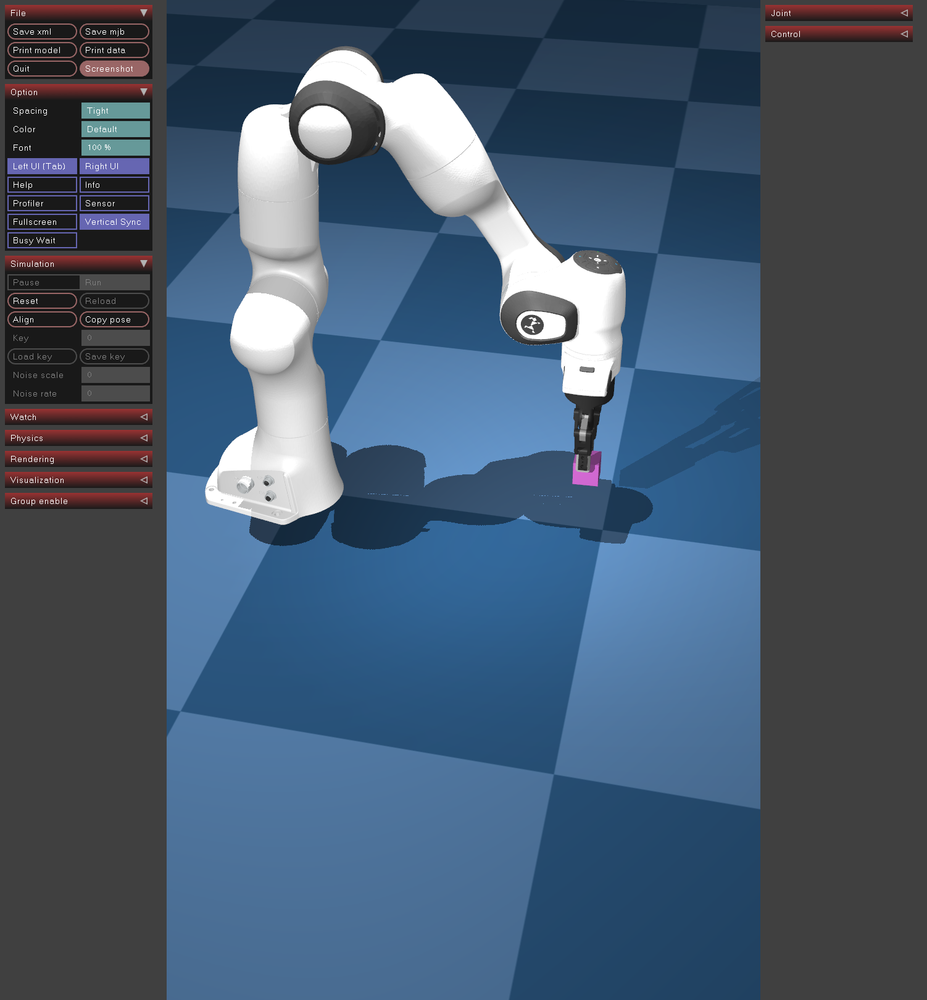

# Train RL in Simulation




## Training a Policy

- Run the RL actor with a configuration file
```
python -m lerobot.scripts.rl.actor --config_path ./configs/cuda_train_gym_hil_env_actor.json
```

- In different terminal, run the RL learner with a configuration file.
```
python -m lerobot.scripts.rl.learner --config_path ./configs/cuda_train_gym_hil_env_learner.json
```

##  Evaluation 

- To evaluate the trained policy, run the script of rl.eval_policy with a configuration file.
```
python -m lerobot.scripts.rl.eval_policy --config_path ./configs/temp/cuda_eval_gym_hil.json
```

### Reference 
- https://huggingface.co/docs/lerobot/main/en/hilserl_sim
- https://github.com/huggingface/lerobot/blob/d602e8169cbad9e93a4a3b3ee1dd8b332af7ebf8/docs/source/il_sim.mdx


